## 第一章：BCD码补码，逻辑电路与或非，地址总线（了解）
### 1 数和数制
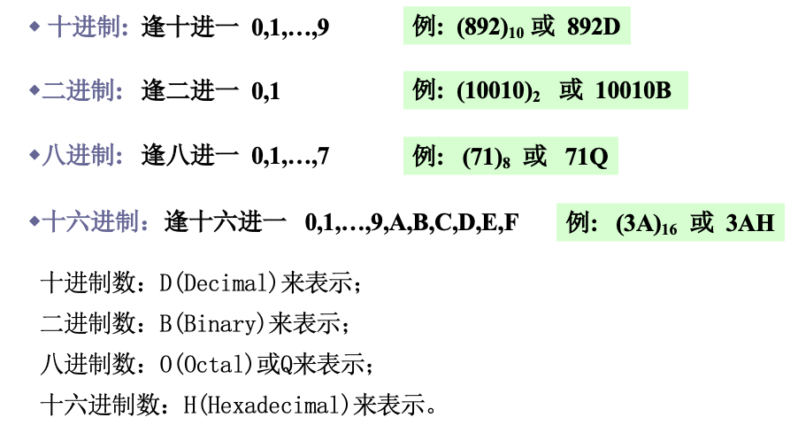
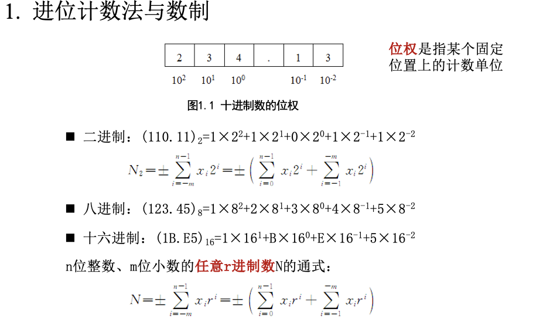

#### 十进制转换为r进制
##### 整数部分
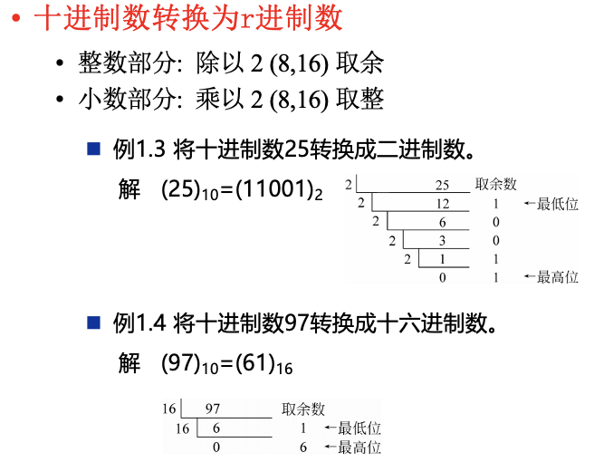

##### 小数部分
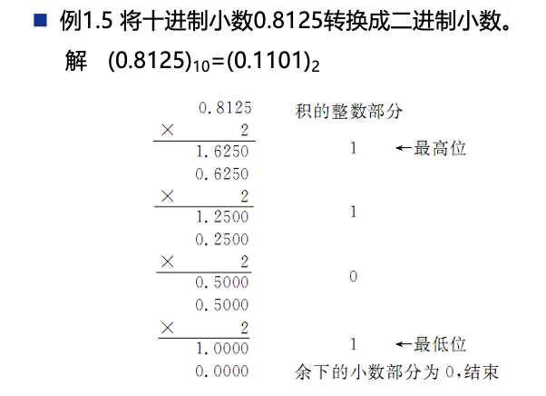

#### 数制转换
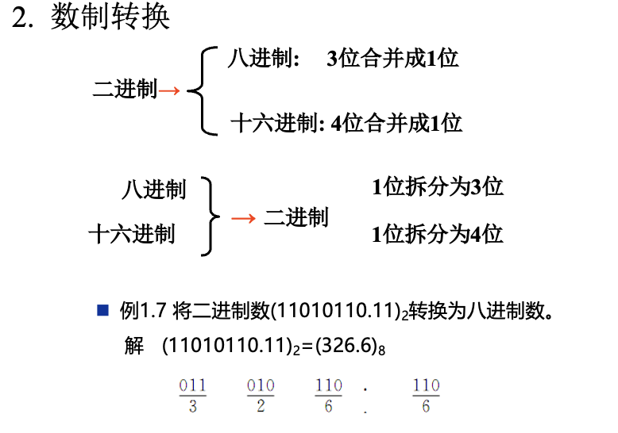

### 2 数据格式
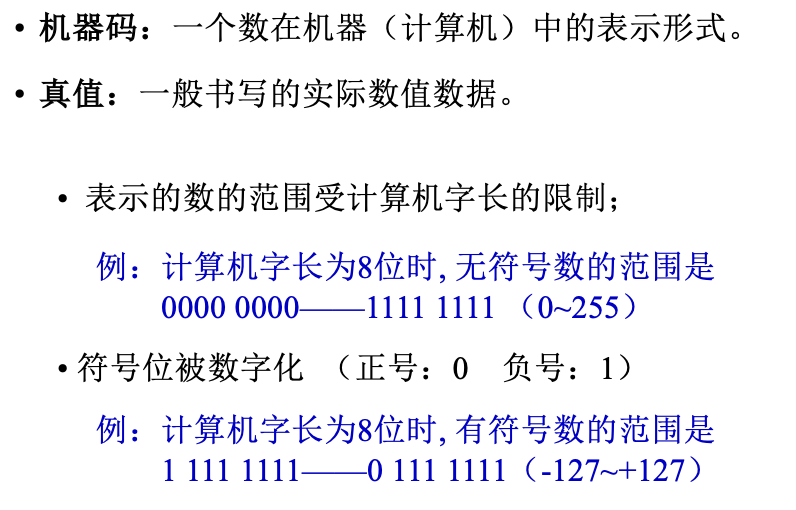

### 3 二进制编码和运算
#### 原码
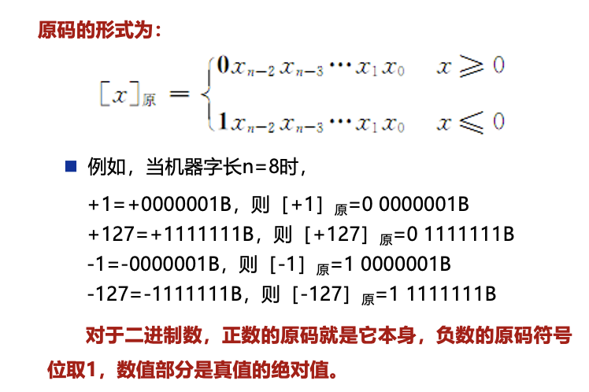
对于二进制数，正数的原码就是本身，负数的原码符号位取。
##### 重点：0有两种原码表示方式，+0和-0。
[+0]原 = 0000 0000B
[-0]原 = 1000 0000B

#### 反码
X>0时，[X]反 = [X]原
X<0时，[X]反 = [X]原除符号位外，各位取反。
例如：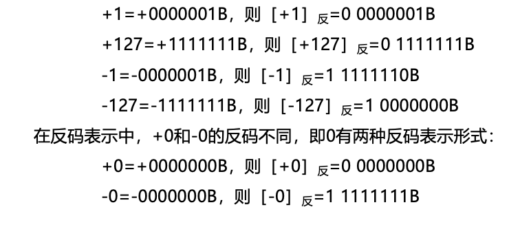
结论：二进制正数的反码和原码相同，负数的反码是原码除符号位外各位取反。

#### 补码
X>0时，[X]补 = [X]原
X<0时，[X]补 = [X]原除符号位外，各位取反，最后加1。也就是反码加1。
例如：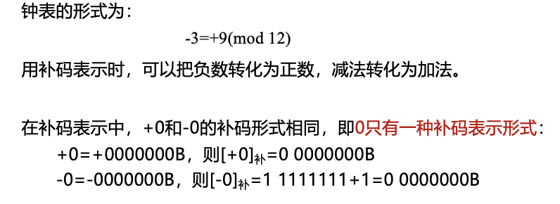
结论：二进制正数的补码和原码相同，负数的补码是原码除符号位外各位取反，最后加1。

+1的补码是0000 0001B
-1的补码是1111 1111B
+127的补码是0111 1111B
-127的补码是1000 0001B
-128的补码是1000 0000B

机器字长为n位，那么最大的正数是2^(n-1) -1，最小的负数是-2^(n-1)。

##### 补码运算
机器数最高位是1的时候，表示负数，求真值的时候，其余n-1位取反加1。
比如：-1的补码是1111 1111B，求真值的时候，减1取反，得到1000 0001B，也就是-1。

##### 二进制补码运算
[X+Y]补 = [X]补 + [Y]补
[X-Y]补 = [X]补 + [-Y]补

**计算结果不能超过补码表示范围，否则溢出**
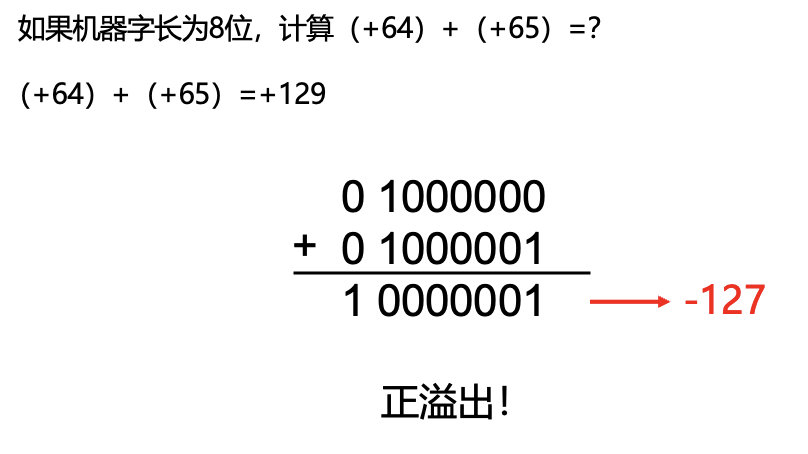

#### 十进制数编码运算
BCD码：二进制编码的十进制数，每个十进制数用4位二进制数表示。
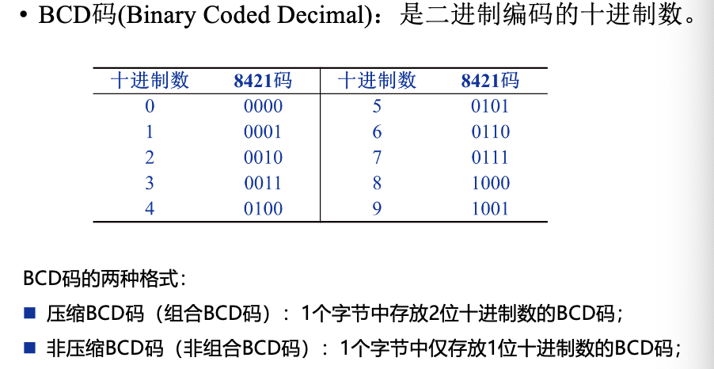
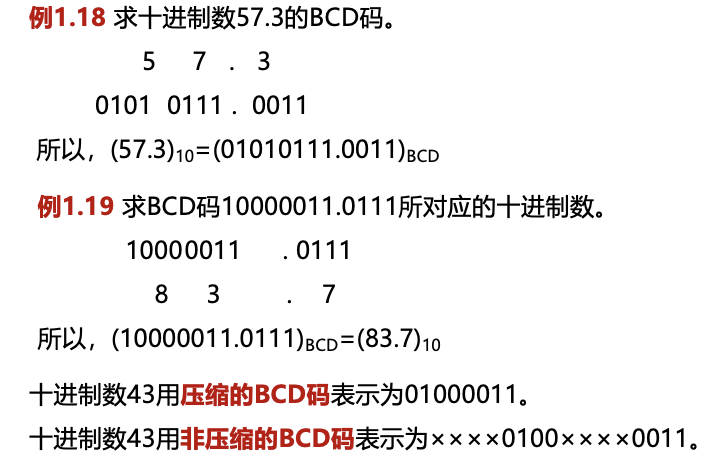

**BCD码计算的时候，如果结果大于9，需要加6修正**
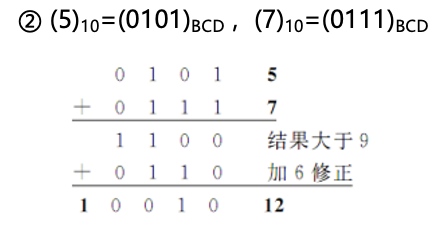

### 4 逻辑电路
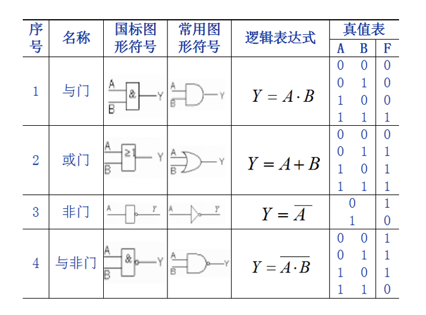
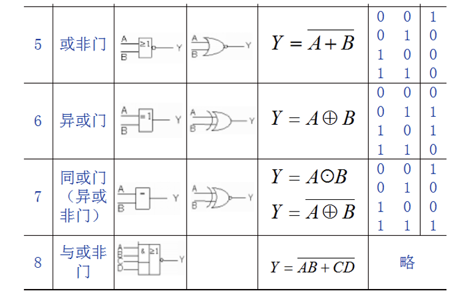

### 计算机系统组成
#### 冯·诺伊曼计算机
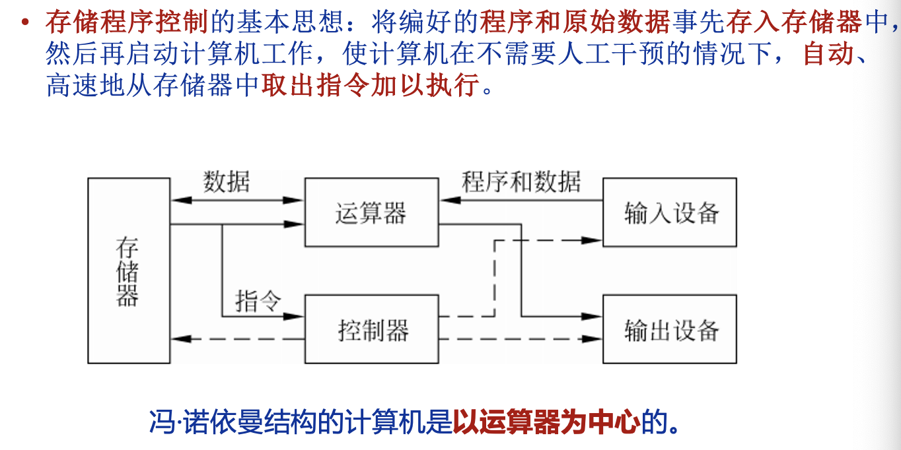
此时是以运算器为中心，存储器和控制器分开的。

之后的现代计算机是以存储器为中心，运算器和控制器合并在一起。
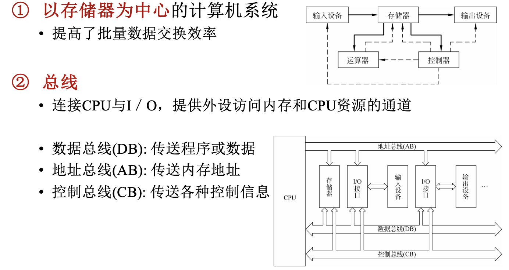

##### 总线
总线就是一组共享的通信线路，用于连接计算机各个部件，传送数据和控制信息。

##### I/O系统
又称作适配器，存在于CPU和外设之间，是信息交换的中转站。用于解决CPU和外设之间的速度不匹配问题。

### 主要性能指标
#### 字长
位 bit，是计算机进行数据处理的最小单位。字长是CPU一次能处理的二进制数据位数，也是CPU内部寄存器的位数。
字节 byte，是计算机存储数据的基本单位，1字节=8位。