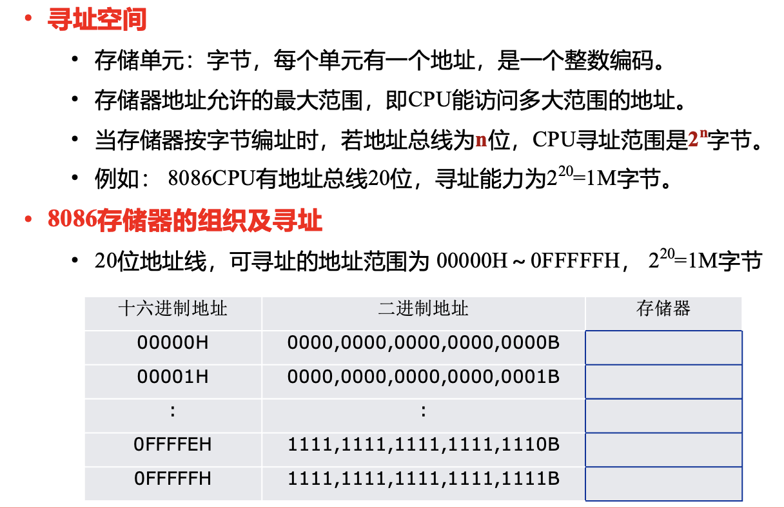
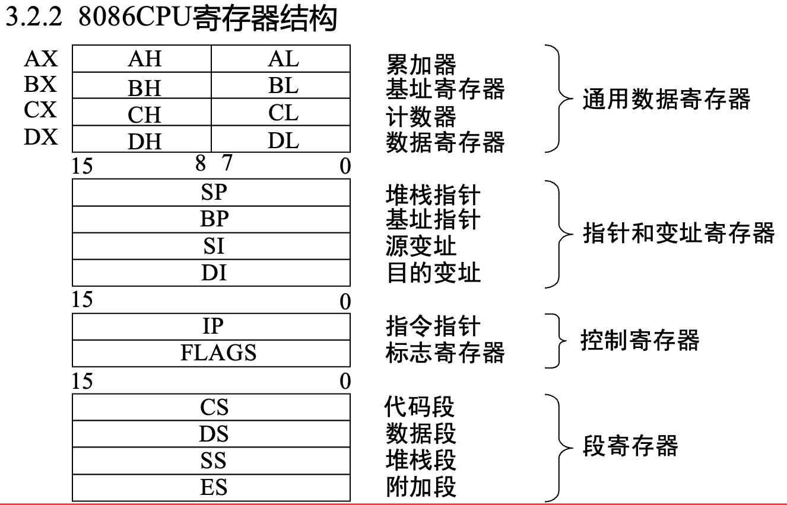

第三章：地址分段结构，3.3 3.29，标识位：6个状态，3.6、3.7不做要求。
## 3.1 存储器组织

### 存储器分段结构

逻辑地址=起始地址：偏移地址

物理地址计算：段地址左移4位+偏移地址

### 分段结构
代码段、数据段、堆栈段、附加数据段
代码段：存放程序代码
数据段：存放程序数据
堆栈段：存放程序运行时的临时数据
附加数据段：存放程序运行时的附加数据

## 3.2 8086内部结构
BIU：总线接口单元，从内存中取指令和数据
EU：执行单元，执行指令
两个单元可以并行工作，提高效率

### 寄存器结构

#### 通用寄存器

#### 专用寄存器

**CF(carry flag)**：进位标志,算术运算有进位时为1，否则为0
**PF(parity flag)**：奇偶标志，运算结果低8位中1的个数为偶数时为1，否则为0
**AF(adjust flag)**：辅助进位标志，运算结果低4位有进位时为1，否则为0
**ZF(zero flag)**：零标志，运算结果为0时为1，否则为0
**SF(sign flag)**：符号标志，运算结果为负数时为1，否则为0
**OF(overflow flag)**：溢出标志，运算结果超出寄存器位数时为1，否则为0
**IF(interrupt flag)**：中断标志，为1时允许中断，为0时禁止中断
**DF(direction flag)**：方向标志，为1时串行指令执行方向为减，为0时为加1
**TF(trace flag)**：跟踪标志，为1时单步执行，为0时正常执行

## 3.3 总线工作周期

大彻大悟，那我的i5-13500H的主频是3.5GHz，最大睿频的意思就是可以加速到这个频率，所以频率越高，基本时间单位越小，所以速度越快。

## 3.4 8086中断
两类：硬件中断（外部中断）、软件中断（内部中断）

优先顺序（高到低）：软件中断（除单步中断外），非屏蔽中断，屏蔽中断，单步中断

中断向量在IBT中的存放地址：4*中断号

每个中断向量占4个字节，前两个字节存放中断处理程序的段地址，后两个字节存放中断处理程序的偏移地址