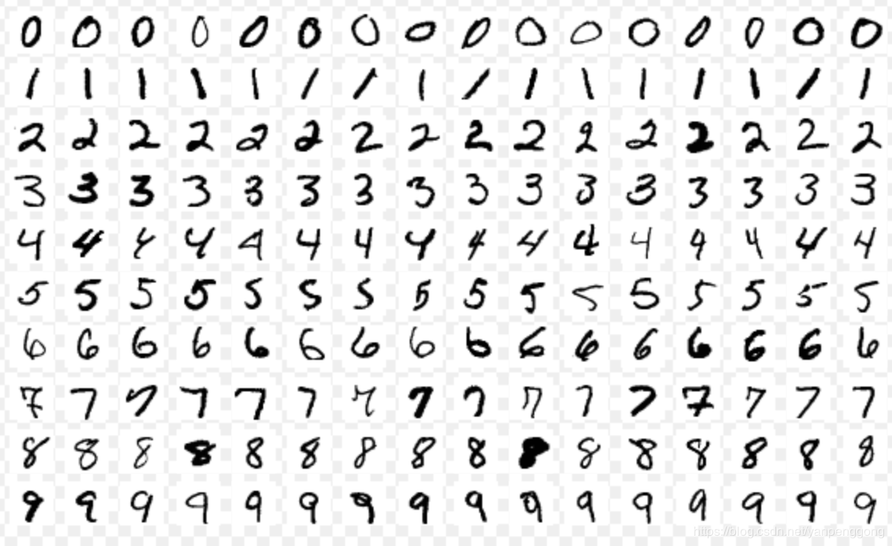

# 机器学习第一次作业

姓名：叶茂青

学号：17363092

---

以手写数字识别为例，按照如下的定义

> A computer program is said to learn from experience E with respect to some class of tasks T and performance measure P, if its performance at tasks in T, as measured by P, improves with experience E."

T为识别指定图片中的数字是什么

E是分好类的数字图片

P是正确分类的比率（数量）

属于有监督学习中的分类任务

使用的数据如下

使用的机器学习算法除了深度学习，也可以使用knn，贝叶斯分类等算法

以knn算法为例，原理如下

测试样本（绿色圆形）应归入要么是第一类的蓝色方形或是第二类的红色三角形。通过找到距离测试样本最近的k个样本，通过投票的方式的决定样本的分类。

如果k=3（实线圆圈）它被分配给第二类，因为有2个三角形和只有1个正方形在内侧圆圈之内。如果k=5（虚线圆圈）它被分配到第一类（3个正方形与2个三角形在外侧圆圈之内）。

## 启发和启示

有一说一，没啥启发和启示