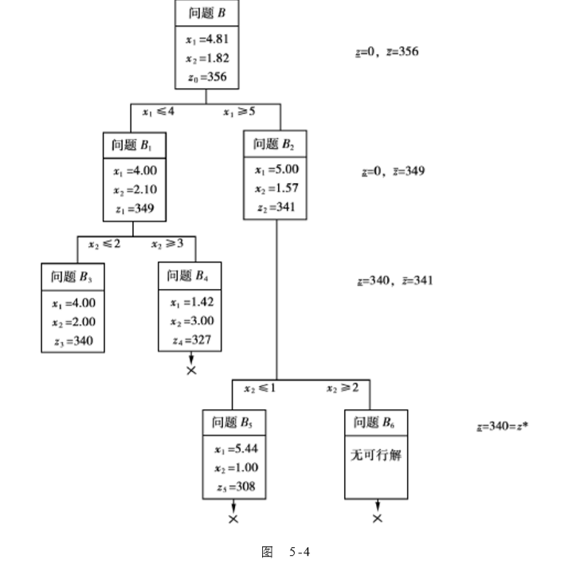
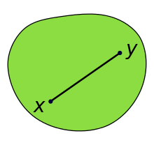
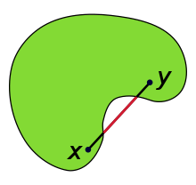

## 梯度下降法

深度学习最常见的算法了，之前写过一次就直接复制上次的了

梯度下降法的思路是利用函数的一阶导数信息，通过向负梯度方向移动一段距离，使得函数值向着低点的方向移动

公式如下
$$
x^{(k+1)}=x^{(k)}-\alpha \bigtriangledown J(x)
$$

### 梯度下降法的分类

### 批量梯度下降法（Batch Gradient Descent）

每次更新参数时使用所有的样本进行更新

#### 随机梯度下降（Stochastic Gradient Descent）

随机采样一个样本对参数进行更新

#### 批量梯度下降法（Mini-batch Gradient Descent）

每次更新参数时用一部分样本

### 针对梯度下降法的优化

以下图及代码源自cs231n

最基础的算法随机梯度下降法

```python
while True:
    dx = computer_gradient(x)
    x -= learning_rate * dx
```

随机梯度下降法的缺点：

1. 如下图，在某个方向（图中为竖直方向）很敏感，而其他方向不敏感，因此损失呈之字形移动，而这让训练变得很慢
2. 在某个局部最小点卡住，或者在鞍点附近缓慢甚至停止移动。在高维空间中，鞍点的问题出现的可能性更大。

#### 动量优化法

```python
vx = 0
while True:
    dx = computer_gradient(x)
    vx = rho * vx + dx
    x -= learning_rate * vx
```

保持一个不随时间变化的速度，将梯度估计添加到这个速度上，然后在这个速度的方向上步进，而不是在梯度的方向上步进

超参数ρ，摩擦系数，一般取较大的数字

如图，加上速度后，可避免在局部最小点或鞍点卡住，因为即使那个地方梯度很小，依然有一个速度向量推动其前进


##### Nesterov Momentum

另外一种加动量的方式
$$
v_{t+1}=\rho v_t-\alpha \triangledown  f(x_t+\rho v_t)\\
x_{t+1}=x_t+v_{t+1}\\
\ \\
\ \ \ let \ \ \tilde{x_t} = x_t+\rho+pv_t \ \ then\\
v_{t+1}=\rho v_t-\alpha \triangledown  f(\tilde{x_t})\\
x_{t+1}=\tilde{x_t} - \rho v_t+(1+\rho)v_{t+1}\\
 \qquad \ \ =\tilde{x_t}+v_{t+1}+\rho(v_{t+1}-v_t)
$$

```python
v = 0
while True:
    dx = computer_gradient(x)
    old_v = v
    v = rho * v - learning_rate * dx
    x -= -rho * old_v + (1 + rho) * v
```

#### 缩放优化

##### AdaGrad

```python
grad_squared = 0
while True:
    dx = computer_gradient(x)
    grad_squared += dx * dx 
    x -= learning_rate * dx / (np.sqrt(grad_squared) + 1e-7) # 1e-7保证不会除于一个0
```

在有高梯度的轴，由于`np.sqrt(grad_squared) + 1e-7`项的存在，使得在这个轴上运动的速度变慢

相应的，在低梯度的轴，这会让在这个轴上的运动速度加快

因为`grad_squared`一直在增加，所以训练的步长会随着时间而减少，但这也有可能会让训练在一个局部最小点卡住，因此有RMSProp解决这个问题

##### RMSProp

```python
grad_squared = 0
while True:
    dx = computer_gradient(x)
    grad_squared = decay_rate * grad_squared + (1 - decay_rate) * dx * dx # decay_rate 一般为0.9或者0.99
    x -= learning_rate * dx / (np.sqrt(grad_squared) + 1e-7)
```

##### Adam

动量优化与AdaGrad/RMSProp的结合，一般状况下的首选

```python
first_moment = 0
second_moment = 0
while True:
    dx = computer_gradient(x)
    first_moment = beta1 * first_moment + (1 - beta1) * dx # Momentum
    second_moment = beta2 * second_moment + (1 - beta2) *dx * dx # AdaGrad/RMSProp
    x -= learning_rate * first_moment / (np.sqrt(second_moment) + 1e-7) # AdaGrad/RMSProp
```

为了避免开始时步长过大，所以有下面的优化

```python
first_moment = 0
second_moment = 0
for t in range(num_iterations):
    dx = computer_gradient(x)
    first_moment = beta1 * first_moment + (1 - beta1) * dx # Momentum
    second_moment = beta2 * second_moment + (1 - beta2) *dx * dx # AdaGrad/RMSProp
    first_unbias = first_moment / (1 - beta1 ** t) # Biad correction
    second_unbias = second_moment / (1 - beta2 ** t) # Biad correction
    x -= learning_rate * first_unbias / (np.sqrt(second_unbias) + 1e-7) # AdaGrad/RMSProp
```

Adam的超参数一般设置为：beta1 = 0.9，beta2 = 0.999，learning_rate = 1e-3 or 5e-4

## 牛顿法和拟牛顿法

梯度下降法只用到目标函数的一阶导数信息，牛顿法是一种二阶优化算法

求解$f(x)=0$的步骤如下：

1. 计算当前点的斜率$f'(x_0)$，过当前点作斜率为$f'(x_0)$的直线（也就是作一条切线）
2. 计算切线与x轴的交点$(x_1,0)$
3. 用$(x_1,f(x_1))$重复迭代过程

迭代公式可化简为如下所示：
$$
x_{n+1}=x_n-\frac{f(x_n)}{f'(x_n)}
$$


对于优化中求极大极小值的问题，实际上就是求函数导数为0的点，也就是求$f'(x)=0$的点，迭代公式如下
$$
x_{n+1}=x_n-\frac{f'(x_n)}{f''(x_n)}
$$


牛顿法的收敛速度要比只考虑一阶导数信息的梯度下降法快，但是计算二阶导数信息成本比较大，所以很少被用到。

## 拟牛顿法

一年了依旧没去搜索具体的相关算法，咕

## 拉格朗日对偶

拉格朗日对偶可以将一个带有约束的最优化问题，转变为无约束的最优化问题

对于无约束的最优化问题，如$min\ f(x)=x^2,x\in R$，只需要对$f(x)$求导，找出梯度为0的点代入原式对比就可以找到最小值（梯度为0的点有可能是最大值，最小值，鞍点）

如果假设$f(x)$是凸函数，那么梯度为0不仅是局部最优解的必要条件，还是充分条件，而且局部最优解就是全局最优解

对于带等式约束的最优化问题，如求双曲线函数 xy=3 上距离原点最近的点的坐标，数学表示如下
$$
min\ f(x,y)=\sqrt{x^2+y^2}\\
g(x,y)=xy=3
$$
可视化这个问题如下


明显，两个函数的曲线相切的点就是我们要求的点。如果把双曲线看作自身的等高线，那么两个等高线相切时，二者在切点处的切线也相同，也就是说它们的梯度向量平行，即：


此时一个梯度向量可以写为另一个的常数倍：
$$
\nabla f=\lambda \nabla g
$$
即问题转化为
$$
\left\{\begin{array}{l}
\nabla f=\lambda \nabla g \\
g(x, y)=C
\end{array}=>\left\{\begin{array}{l}
f_{x}=\lambda g_{x} \\
f_{y}=\lambda g_{y} \\
g(x, y)=C
\end{array}=>\left\{\begin{array}{l}
2 x=\lambda y \\
2 y=\lambda x \\
x y=3
\end{array}\right.\right.\right.
$$
求解之后即可得出答案，该方程组称为拉格朗日方程组

定义一个拉格朗日函数，令其偏导为0，加上原来的约束，就可以得到拉格朗日方程组
$$
L(x,\lambda)=f(x)+\lambda g(x)
$$


对于带不等式约束的优化问题，比如把刚才的问题改成
$$
min\ f(x,y)=\sqrt{x^2+y^2}\\
g(x,y)=xy\geq3
$$
可行域扩大了，但是极值点其实还是相切的位置，所以答案还是一样的，但当有多个不等式时，需要用到KKT条件


对于同时带等式和不等式约束的优化问题也需要用到KKT条件


## KKT条件

对于即带等式约束又有不等式约束的问题，需要用到KKT条件，可以看作拉格朗日乘数法的扩展

对于如下的优化问题
$$
min\ f(x)\\
g_i(x)\leq0,i=1,2,...,q\\
h_i(x)=0,i=1,2,...,p
$$
构造拉格朗日函数
$$
L(x, \lambda, \mu)=f(x)+\sum_{j=1}^{p} \lambda_{j} h_{j}(x)+\sum_{k=1}^{q} \mu_{k} g_{k}(x)
$$
$\lambda$和$\mu$称为KKT乘子。在最优解处$x^*$应该满足如下条件
$$
\begin{aligned}
&\nabla_{x} L\left(x^{*}\right)=0\\
&\mu_{k} \geqslant 0\\
&\mu_{k} g_{k}\left({x}^{*}\right)=0\\
&h_{j}\left(x^{*}\right)=0\\
&g_{k}\left({x}^{*}\right) \leqslant 0
\end{aligned}
$$
1指拉格朗日函数的偏导为0，2式约束KKT乘子大于等于0，3式约束目标函数顶点的梯度方向可以由约束函数在线性的表示出来，4,5式是题目原来的约束

不知道该怎样描述= =，建议看下[这个](https://www.zhihu.com/question/58584814/answer/159863739)

KKT条件是局部极小值点的必要条件，但不是充分条件，也就是求得的解也有可能是最大值点，鞍点，只能把解代入原方程中判断

## 凸优化

凸优化的性质其实前面的也有讲到，就是可以让梯度为0是局部最优解的充要条件，而且局部最优解就是全局最优解

对于非凸优化问题，由于需要验证结果，所以肯定是个NP问题，而且在深度学习庞大的参数里面去找全局最优是NP-hard的

现实中大多数问题也是非凸优化，但是可以分解成一个个凸优化问题去求解，例如整数规划问题（终于感受到运筹学的作用）的可行域肯定是个非凸集（毕竟都是离散的，你找两个整数点连线中间肯定一堆不是整数）

分支定界解法的思路就是把整数约束去掉，让问题变成线性规划（凸优化）问题，并不断加入上下届的约束最后得到结果



割平面法也是一样，直接把整数约束丢掉

### 凸集

对于集合内的每一对点，连接该对点的直线段上的每个点也在该集合内，数学表示即
$$
若C为凸集，则\theta x+(1-\theta)y\in C\\0\leq\theta\leq1
$$


凸集



非凸集（凹集）

常见的凸集：

1. 仿射子空间

$$
x\in R^n;Ax=b
$$


2. 多面体

$$
x\in R^n;Ax\leq b
$$

线性等式或不等式约束条件定义的可行域是凸集

## 参考资料

- 《机器学习与应用》（雷明）
- [Machine Learning From Scratch](https://machine-learning-from-scratch.readthedocs.io/zh_CN/latest/最优化算法.html#id9)
- Wikipedia（部分图源Wikipedia）
- CS231N
- 《运筹学·第三版》清华大学出版社

