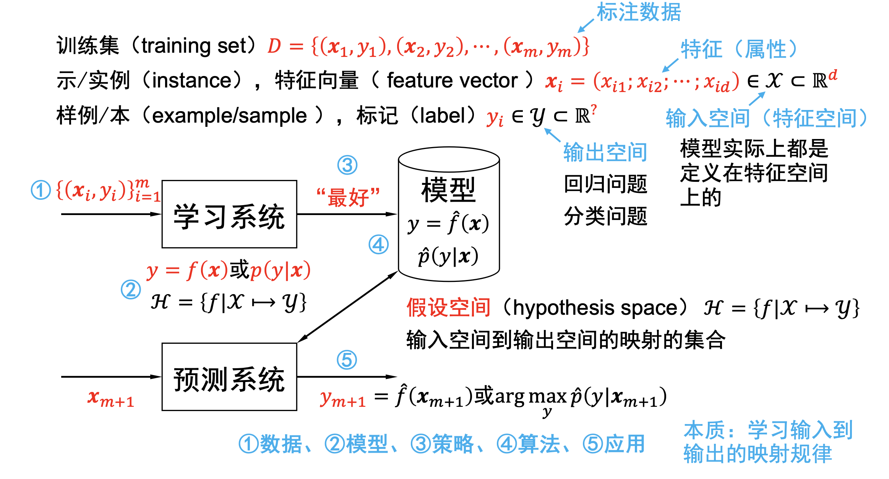
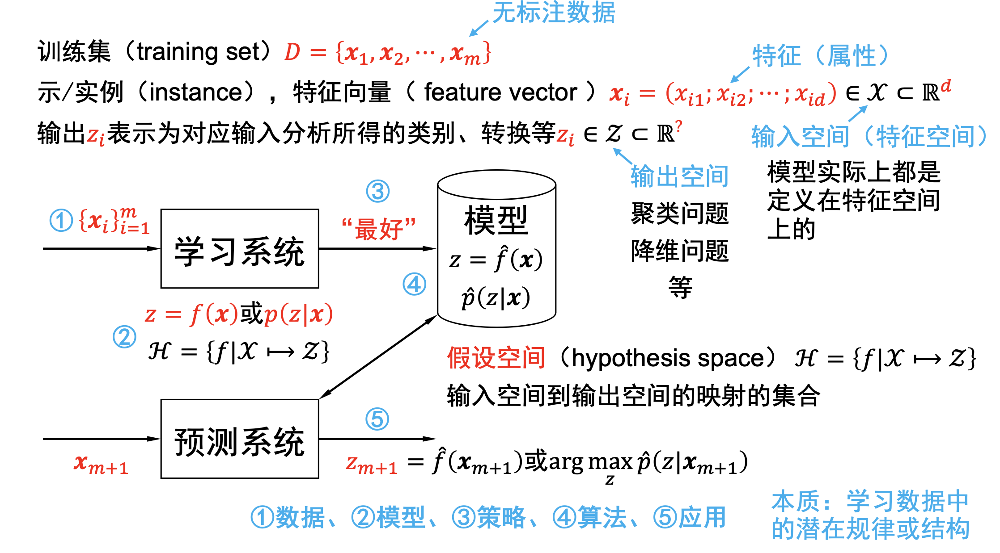
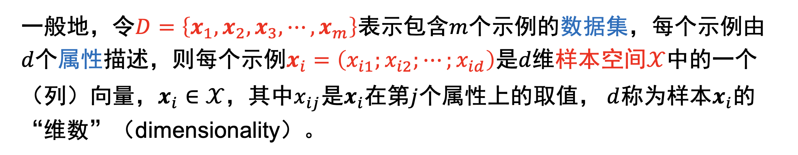
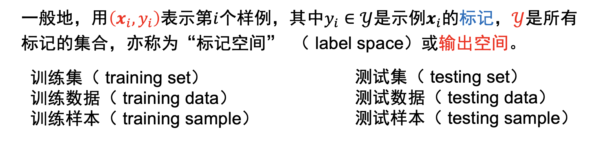
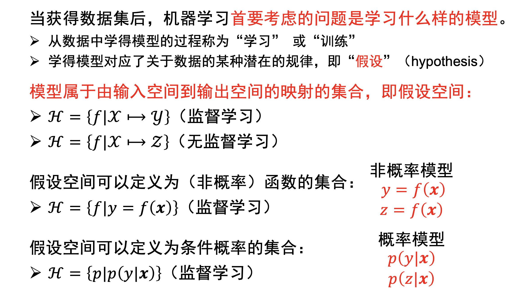
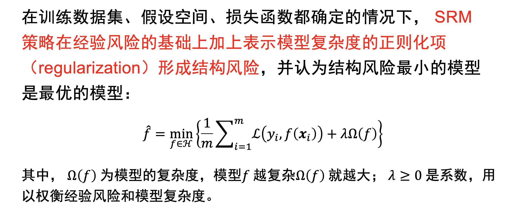

## Introduction

#### What is Machine Learning

"A computer program is said to learn from experience E with respect to some class of tasks T and performance measure P, if its performance at tasks in T, as measured by P, improves with experience E."

程序通过利用经历E，在T的任务中获得了性能改善，就说关于T和P，对E进行了学习。

Example: playing checkers.

E = the experience of playing many games of checkers

T = the task of playing checkers.

P = the probability that the program will win the next game.
***

#### Supervised Learning
example:线性，神经，支持向量机，决策树，集成学习

- Regression 回归：输出连续值
- Classification 分类：输出离散值{0,1}

从标注数据中学习预测模型的问题。

训练集，特征向量，标记。
**本质：学习输入到输出的映射关系。**

#### Unsupervised Learning
example:聚类，降纬
在脱离标签的情况下，从数据中直接找出数据的结构。
“自然”得到的数据，没有标签。

**本质：学习数据潜在的结构。**

#### Reinforcement learning
example:有模型，无，k—摇臂赌博机
智能系统在与环境交互的过程中，通过奖励机制学习最优策略。
长期奖励的最大化为目的，不断的试错，从所有的策略中学得最优策略。
**本质：学习如最优的序贯策略。**

***
#### 机器学习关键要素
数据，模型，策略，算法

##### 数据

##### 模型

##### 策略
###### ERM

###### SRM
样本容量较小时，ERM模型产生过拟合现象，SRM就是预防这种结果出现的。
结果风险小的模型对训练数据、未知的测试数据都有良好的预测。

***
### 名次解析
#### 泛化能力
模型对未知数据的预测能力

#### 过拟合
学习能力太强；克服方法：优化目标中增加正则项，增加训练数据量，减少特征量，进行模型选择

机器学习器把训练样本学的太好，将训练样本本身的特点当作所有样本的一般性质，导致泛化能力下降。

#### 欠拟合
学习能力太弱；克服方法：增加模型复杂度，训练轮数

通过训练算法得出一个h(hypothesis)

#### Cost Function

衡量模型的函数，通常用$J(\theta)$表示

