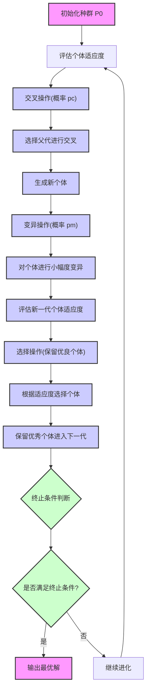

```mermaid
graph TD
    A[初始化种群 P0] --> B[评估个体适应度]
    B --> C["交叉操作(概率 pc)"]
    C --> D[选择父代进行交叉]
    D --> E[生成新个体]
    E --> F["变异操作(概率 pm)"]
    F --> G[对个体进行小幅度变异]
    G --> H[评估新一代个体适应度]
    H --> I["选择操作(保留优良个体)"]
    I --> J[根据适应度选择个体]
    J --> K[保留优秀个体进入下一代]
    K --> L{终止条件判断}
    L --> M{是否满足终止条件?}
    M -->|是| N[输出最优解]
    M -->|否| O[继续进化]
    O --> B
     %% 样式定义
    classDef startEnd fill:#f9f,stroke:#333,stroke-width:2px;
    classDef process fill:#ccf,stroke:#333,stroke-width:2px;
    classDef decision fill:#cfc,stroke:#333,stroke-width:2px;
    
    %% 应用样式
    class A,N startEnd;
    class C,D,E,F,G,H,I,J,K process;
    class L,M decision;
```
